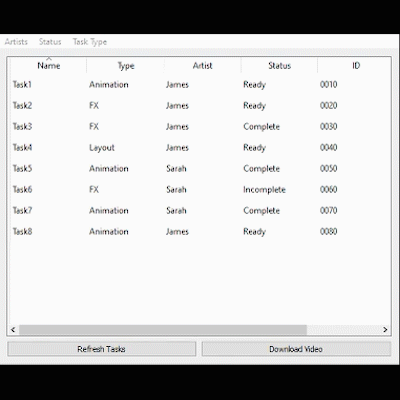
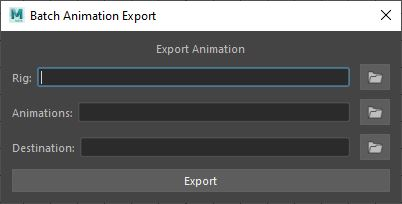

# td-portfolio
A collection of production/pipeline tools to demonstrate my experience with UI/UX design and familiarity with Maya, Python, PyQt, and Unreal engine.

## FoxBearShotgun

The FoxBearShotgun project was a set of tools I began developing for my senior thesis in the fall of 2019. It was meant to enhance production workflow and create less work for artists by creating a standalone app for them to check and update progress on tasks outside of the Shotgun browser service, as well as process and upload new playblasts from Maya to Shotgun. Due to the nature of the production changing over time, we ended up not using Shotgun as much and thus the only part of the tool that remained completed was the standalone app.

## BatchAnimExporter

This was a tool I developed quickly during Greg Richardson's Tech Art course, which will take a given rig file, a list of animation files, and a destination directory, and will batch the process of attaching the animation to the rig and exporting as a new scene.

## UnrealAnimImporter

This was a EUW widget developed quickly during Greg Richardson's Tech Art course, which allows the user to import a batch of animation .fbx to a given character rig.

## CliffsRedshiftNodesUI

A very quick tool I created to speed up setting up a shader network that takes in a string and generates a set of Redshift nodes that are already named.
